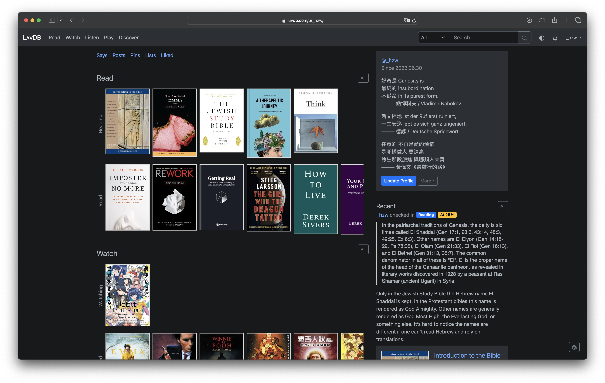
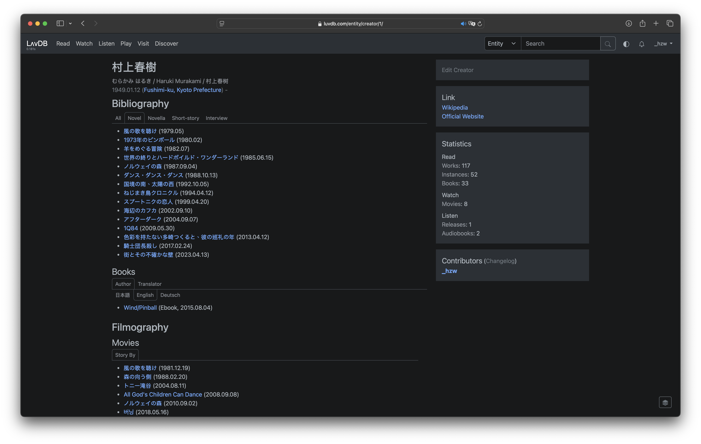

# LʌvDB

LʌvDB is your self-hosted inner space. Primarily a media cataloging app, it centers on books and periodicals, movies and series, music, podcasts, audiobooks, and games. The app features an activity feed that allows you to share your media check-ins with friends. Additionally, it supports microblogging (Say), blogging (Post), bookmarking (Pin), and curating lists of in-site content (List).

## Screenshots / Features

#### Activity Feed (Home Page)


A purely reverse chronological feed displays your activity on the site. You can send updates as a "Say" directly from the feed or link to the page to create a "Post," a "Pin" (bookmark), or a "List". The feed can be filtered by media type (Read, Watch, Listen, Play) of the Check-ins or by content type (Say, Post, Pin, List, and Follow).

#### Profile page



A profile page displays your progress. You can set it to public or private (only logged-in users can see it).

#### Recent page of the Read App


The recent page shows the current trending and most recent additions to the Read app.

#### Book Detail of the Read App


On the book page, you can check in your fleeting thoughts and progress while you read.

#### Creator Detail



We can curate a comprehensive bibliography, filmography, discography, and gameography for creators with linked data.

#### Others

-   LʌvDB offers comprehensive RSS support. If you set your profile to public, others can subscribe to your activity feed, or to specific content such as your Say, Post, or Pin, and even your updates with a specific hashtag, using RSS readers.
-   You can cross-post activities to Mastodon and BlueSky using built-in cross-posters.
-   Interactions on Mastodon and BlueSky can be aggregated to LʌvDB with WebMention through [brid.gy](https://brid.gy).

You can read more about the Making-of LʌvDB [here](https://luvdb.com/@_hzw/posts/making-of/).

#### Live Sneak Peek

You can also explore LʌvDB at [luvdb.com](https://luvdb.com). This instance is currently reserved for friends and is not accepting new registrations. Before deciding to spin up your own instance, you can familiarize yourself with the app through the following pages:

-   [Read](https://luvdb.com/read/recent/)
-   [Watch](https://luvdb.com/watch/recent/)
-   [Listen](https://luvdb.com/listen/recent/)
-   [Play](https://luvdb.com/play/recent/)

## Testing Locally

```bash
# Creating a virtual environment
python -m venv .venv
source .venv/bin/activate

# Installing dependencies
pip install -r requirements.txt

# Initializing environment
touch .env
python -c 'from django.core.management.utils import get_random_secret_key; print(f"SECRET_KEY={get_random_secret_key()}\nFERNET_KEY={get_random_secret_key()}")' > .env
echo "DEBUG=True" >> .env

# Running Django migrations
DJANGO_SETTINGS_MODULE=config.settings.development python manage.py makemigrations
DJANGO_SETTINGS_MODULE=config.settings.development python manage.py migrate

# Load datadump with an anonymous superuser
DJANGO_SETTINGS_MODULE=config.settings.development python manage.py loaddata datadump_anonymized.json
# or create your own superuser and start with zero
# DJANGO_SETTINGS_MODULE=config.settings.development python manage.py createsuperuser

# Starting server
DJANGO_SETTINGS_MODULE=config.settings.development python manage.py runserver
```

The anonymized data dump will only be updated infrequently (note that cover and poster images are not included). You can log in using the username "anonymous" and the password "anonymous". If you prefer to use your own data, you can create a superuser and begin adding data manually.
