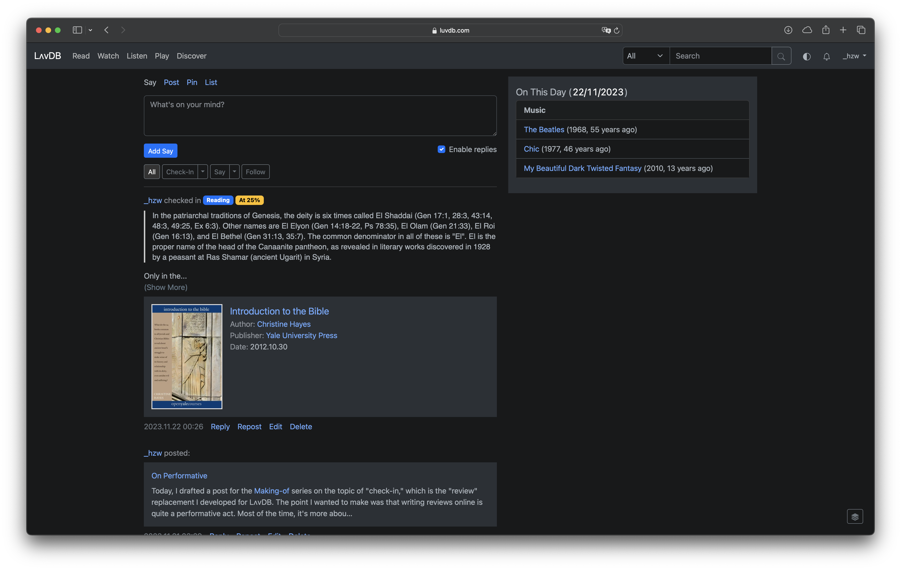
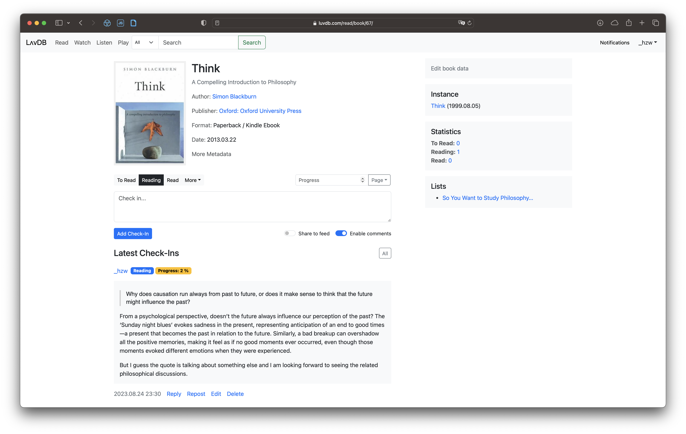

# LʌvDB is... <sup>[1](#f1)</sup>

- an opinionated, self-hosted alternative to Goodreads, IMDB, Discogs, and ultimately, Douban. This Django-based media cataloging application enables you to log and manage your books, movies, music, and games. An inclusive activity feed is also available to stay updated on your friends' activities, including their current readings, watched movies, listened music, and played games.

- LʌvDB is opinionated in the sense that it has no ratings (what's the point?), no reviews (replaced by check-ins), no recommendation (replaced by your friends, if you have any), and most importantly, no imports from other services (you should love it enough to create an entry).

<sup id="f1">[1]</sup> Most of the code in this repository, including this README, has been written by ChatGPT-4, prompted and modified by me.

## Screenshots

#### Activity Feed (Home Page)



#### Recent page of the Read App


#### Book Detail of the Read App



#### Live Sneak Peek

You can also explore LʌvDB at [luvdb.com](https://luvdb.com). This instance is not currently accepting new registrations (and probably never will). To familiarize yourself with the app, you may visit some of the following pages:

- [Read](https://luvdb.com/read/recent/)
- [Watch](https://luvdb.com/watch/recent/)
- [Listen](https://luvdb.com/listen/recent/)
- [Play](https://luvdb.com/play/recent/)

## Testing Locally

```bash
# Creating a virtual environment
python -m venv .venv
source .venv/bin/activate

# Installing dependencies
pip install -r requirements.txt

# Initializing environment
touch .env
python -c 'from django.core.management.utils import get_random_secret_key; print("SECRET_KEY="+get_random_secret_key())' > .env
echo "DEBUG=True" >> .env

# Running Django migrations
DJANGO_SETTINGS_MODULE=config.settings.development python manage.py makemigrations
DJANGO_SETTINGS_MODULE=config.settings.development python manage.py migrate

# Creating super user
DJANGO_SETTINGS_MODULE=config.settings.development python manage.py createsuperuser

# Starting server
DJANGO_SETTINGS_MODULE=config.settings.development python manage.py runserver
```